# Zava Product Manager - A2A Architecture

## Overview

The Zava Product Manager is a **dual-interface AI agent** that serves both human users (via web UI and REST API) and other AI agents (via the Agent-to-Agent protocol). Built with FastAPI and Semantic Kernel, it provides product information and recommendations for Zava's DIY home improvement products.

## Architecture Diagram

```plantuml
@startuml
!theme plain
skinparam backgroundColor #f8fafc
skinparam defaultFontSize 11

package "FastAPI Application Layer" #e0e7ff {
  rectangle "main.py\n**FastAPI App**" as Main #6366f1 {
    [Web UI\ntemplates/index.html]
    [Static Files\n(CSS/JS)]
    [Health Endpoint]
    [Lifespan Management]
  }
}

package "API Interface Layer" #f0fdf4 {
  rectangle "Chat API\n**/api/chat**\napi/chat.py" as ChatAPI #10b981 {
    [POST /message\nNon-streaming]
    [POST /stream\nSSE Streaming]
    [Session Management]
  }
  
  rectangle "A2A Server\n**/a2a**\nagent/a2a_server.py" as A2A #8b5cf6 {
    [GET /agent-card/\nDiscovery]
    [POST /run\nTask Execution]
    [Event Queue\nStreaming]
  }
}

package "Agent Execution Layer" #fef3c7 {
  rectangle "Agent Executor\nagent_executor.py" as Executor #f59e0b {
    [SemanticKernelProduct\nManagementExecutor]
    [Task Lifecycle]
    [Event Publishing]
  }
}

package "Semantic Kernel Layer" #fce7f3 {
  rectangle "SK Agent\nproduct_management_agent.py" as SKAgent #ec4899 {
    [ChatCompletionAgent]
    [Product Catalog Plugin]
    [get_product_info()]
    [rank_products()]
    [Conversation History]
  }
}

cloud "Azure Services" #dbeafe {
  database "Azure OpenAI\nGPT Model" as AzureAI #3b82f6
}

Main -down-> ChatAPI : mounts /api
Main -down-> A2A : mounts /a2a

ChatAPI -down-> Executor : invokes
A2A -down-> Executor : invokes via\nRequestContext

Executor -down-> SKAgent : executes\nwith EventQueue

SKAgent -down-> AzureAI : API calls\n(Managed Identity)

note right of ChatAPI
  **Human-Facing Interface**
  • REST API endpoints
  • Server-Sent Events (SSE)
  • Session-based chat
end note

note right of A2A
  **Agent-Facing Interface**
  • A2A Protocol compliant
  • Agent Card discovery
  • Task-based execution
  • Event-driven streaming
end note

note bottom of SKAgent
  **Authentication:**
  • DefaultAzureCredential
  • Managed Identity support
  • API Key fallback
  
  **Plugins:**
  • Product information lookup
  • Product ranking by criteria
end note

@enduml
```


<details>
<summary>Click to view PlantUML source code</summary>



</details>

### Alternative: View in PlantUML Editor

**Option 1: Online Viewer**  
Copy the PlantUML code above to: http://www.plantuml.com/plantuml/

**Option 2: VS Code Extension**  
1. Install "PlantUML" extension
2. Open this README in VS Code
3. Press `Alt+D` to preview the diagram

**Option 3: Generate Image Locally**
```bash
# Install PlantUML
npm install -g node-plantuml

# Generate PNG
puml generate architecture.puml -o architecture.png
```

## Key Components

### 1. Main Application (`main.py`)

**FastAPI application** with lifecycle management that serves as the entry point for both human and agent interactions.

**Features:**
- 🌐 Serves web UI from `templates/index.html`
- 📁 Mounts static files (CSS/JS) at `/static`
- ❤️ Health check endpoint at `/health`
- 🔄 Lifespan management for resource initialization/cleanup
- 🔌 Dual interface mounting:
  - Chat API at `/api/chat`
  - A2A Server at `/a2a`

**Configuration:**
```python
# Environment Variables
HOST=0.0.0.0
PORT=8001
```

---

### 2. Chat API (`api/chat.py`)

**Human-facing REST API** for traditional request/response and streaming chat.

**Endpoints:**

#### `POST /api/chat/message`
Non-streaming chat endpoint.

**Request:**
```json
{
  "message": "Which paint roller is best for smooth surfaces?",
  "session_id": "optional-session-id"
}
```

**Response:**
```json
{
  "response": "For smooth surfaces, I recommend...",
  "session_id": "uuid-v4",
  "is_complete": false,
  "requires_input": true
}
```

#### `POST /api/chat/stream`
Server-Sent Events (SSE) streaming endpoint.

**Request:** Same as `/message`

**Response:** SSE stream
```
data: {"content": "For smooth", "session_id": "...", "is_complete": false}
data: {"content": " surfaces", "session_id": "...", "is_complete": false}
data: {"content": "...", "session_id": "...", "is_complete": true}
```

---

### 3. A2A Server (`agent/a2a_server.py`)

**Agent-facing A2A Protocol server** enabling agent-to-agent communication.

**Features:**
- 📇 **Agent Card Discovery** - Exposes agent capabilities, skills, and examples
- 🎯 **Task Execution** - Handles standardized A2A task requests
- 📡 **Event-Based Streaming** - Real-time task status updates
- 🔗 **Interoperability** - Compatible with other A2A-compliant agents

**Agent Card:**
```json
{
  "name": "Zava Product Helper",
  "description": "Provides product information and recommendations",
  "url": "http://localhost:8001/",
  "version": "1.0.0",
  "defaultInputModes": ["text"],
  "defaultOutputModes": ["text"],
  "capabilities": {
    "streaming": true
  },
  "skills": [
    {
      "id": "product_helper_sk",
      "name": "Zava Product Helper",
      "description": "Handles customer inquiries about products...",
      "tags": ["product", "catalog", "customer-support", "semantic-kernel"],
      "examples": [
        "Which paint roller is best for smooth surfaces?",
        "Sell me on the benefits of the Zava paint sprayer."
      ]
    }
  ]
}
```

**Endpoints:**
- `GET /a2a/agent-card/` - Agent discovery
- `POST /a2a/run` - Execute task

---

### 4. Agent Executor (`agent/agent_executor.py`)

**A2A Protocol adapter** that bridges the A2A server with the Semantic Kernel agent.

**Responsibilities:**
- 🔄 Manages task lifecycle states
- 📤 Publishes events to A2A event queue
- 🎭 Translates between A2A protocol and SK agent

**Task States:**
```python
TaskState.working          # Agent is processing
TaskState.input_required   # Needs user clarification
TaskState.completed        # Task finished successfully
```

**Events Published:**
- `TaskStatusUpdateEvent` - Status changes (working → completed)
- `TaskArtifactUpdateEvent` - Results and outputs

---

### 5. Semantic Kernel Agent (`product_management_agent.py`)

**Core business logic** using Microsoft Semantic Kernel framework.

**Features:**
- 🤖 **ChatCompletionAgent** with Azure OpenAI
- 🔐 **Managed Identity Authentication** (DefaultAzureCredential)
- 🛠️ **Product Catalog Plugin** with kernel functions:
  - `get_product_info(product_name)` - Retrieve product details
  - `rank_products(criteria)` - Rank products by customer needs
- 💬 **Conversation History** - Session-based context management
- 🌊 **Dual Modes** - Streaming and non-streaming

**Azure OpenAI Configuration:**
```python
# Environment Variables
gpt_endpoint=https://your-resource.openai.azure.com/
gpt_deployment=gpt-4o
gpt_api_version=2024-05-01-preview
gpt_api_key=optional-if-using-managed-identity
```

**Authentication Priority:**
1. Managed Identity (DefaultAzureCredential) - Recommended for Azure
2. API Key fallback - For local development

---

### 6. Deployment Configuration (`gunicorn.conf.py`)

**Production-ready Gunicorn configuration** optimized for Azure App Service.

**Key Settings:**
```python
bind = "0.0.0.0:8001"              # Dynamic port from Azure
workers = 1                         # Single worker for B1/F1 tiers
worker_class = "uvicorn.workers.UvicornWorker"  # ASGI support
timeout = 300                       # 5-minute timeout for AI ops
preload_app = True                 # Memory optimization
accesslog = "-"                    # Azure Monitor integration
```

**Why These Settings?**
- ⚡ **Single Worker** - Sufficient for low-traffic apps, reduces memory
- ⏱️ **5-Minute Timeout** - AI operations can take time
- 📊 **Stdout Logging** - Azure App Service captures logs automatically
- 🔄 **Worker Restart** - After 1000 requests to prevent memory leaks

---

## Data Flow

### Human Chat Request Flow

```
User Browser
    │
    ├─→ GET / (Web UI)
    │   └─→ templates/index.html
    │
    └─→ POST /api/chat/stream
        └─→ Chat API Router
            └─→ SemanticKernelProductManagementAgent.stream()
                └─→ Azure OpenAI GPT Model
                    └─→ SSE Stream Response
                        └─→ User Browser
```

### Agent-to-Agent Request Flow

```
Remote AI Agent
    │
    ├─→ GET /a2a/agent-card/ (Discovery)
    │   └─→ A2A Server
    │       └─→ Returns Agent Card JSON
    │
    └─→ POST /a2a/run (Task Execution)
        └─→ A2A Server
            └─→ SemanticKernelProductManagementExecutor.execute()
                └─→ SemanticKernelProductManagementAgent.stream()
                    └─→ Azure OpenAI GPT Model
                        └─→ Event Queue (TaskStatusUpdateEvent)
                            └─→ A2A Protocol Response
                                └─→ Remote AI Agent
```

---

## File Structure

```
src/a2a/
├── main.py                          # FastAPI application entry point
├── gunicorn.conf.py                 # Production server configuration
├── __init__.py
│
├── agent/                           # Agent implementation
│   ├── __init__.py
│   ├── a2a_server.py               # A2A Protocol server
│   ├── agent_executor.py           # A2A executor adapter
│   └── product_management_agent.py # Semantic Kernel agent
│
├── api/                            # REST API endpoints
│   ├── __init__.py
│   └── chat.py                     # Chat endpoints
│
├── static/                         # Frontend assets
│   ├── css/
│   │   └── style.css
│   └── js/
│       └── chat.js
│
└── templates/                      # HTML templates
    └── index.html                  # Chat UI
```

---

## Environment Variables

Create a `.env` file in the `src/a2a` directory:

```env
# Server Configuration
HOST=0.0.0.0
PORT=8001

# Azure OpenAI Configuration
gpt_endpoint=https://your-resource.openai.azure.com/
gpt_deployment=gpt-4o
gpt_api_version=2024-05-01-preview
gpt_api_key=your-api-key-optional

# Optional: Other service configurations
AZURE_CLIENT_ID=your-managed-identity-client-id
AZURE_TENANT_ID=your-tenant-id
```

---

## Running the Application

### Local Development

```bash
# Navigate to the a2a directory
cd src/a2a

# Install dependencies
pip install -r requirements.txt

# Run with uvicorn (development)
uvicorn main:app --reload --host 0.0.0.0 --port 8001

# Or run with Python directly
python main.py
```

**Access:**
- Web UI: http://localhost:8001/
- Chat API: http://localhost:8001/api/chat/
- A2A Agent Card: http://localhost:8001/a2a/agent-card/
- Health Check: http://localhost:8001/health

### Production (Azure App Service)

```bash
# Deploy with Gunicorn
gunicorn -c gunicorn.conf.py main:app
```

**Azure App Service automatically:**
- Sets the `PORT` environment variable
- Captures stdout/stderr logs to Azure Monitor
- Restarts the application on failure
- Provides managed identity for Azure OpenAI

---

## API Usage Examples

### Human Chat (REST)

```bash
# Non-streaming
curl -X POST http://localhost:8001/api/chat/message \
  -H "Content-Type: application/json" \
  -d '{"message": "What paint colors do you have?"}'

# Streaming (SSE)
curl -N http://localhost:8001/api/chat/stream \
  -H "Content-Type: application/json" \
  -d '{"message": "What paint colors do you have?"}'
```

### Agent-to-Agent (A2A Protocol)

```bash
# Discover agent capabilities
curl http://localhost:8001/a2a/agent-card/

# Execute task
curl -X POST http://localhost:8001/a2a/run \
  -H "Content-Type: application/json" \
  -d '{
    "contextId": "session-123",
    "message": {
      "role": "user",
      "content": [{"type": "text", "text": "Recommend paint for living room"}]
    }
  }'
```

---

## Key Features

### ✅ Dual Interface Architecture
- **Human-facing:** Web UI + REST API with SSE streaming
- **Agent-facing:** A2A Protocol for agent-to-agent communication

### ✅ Secure Authentication
- **Managed Identity:** DefaultAzureCredential for passwordless auth
- **API Key Fallback:** For local development

### ✅ Production Ready
- **Gunicorn Configuration:** Optimized for Azure App Service
- **Health Checks:** `/health` endpoint for monitoring
- **Structured Logging:** Azure Monitor integration

### ✅ Streaming Support
- **SSE (Server-Sent Events):** Real-time responses for humans
- **A2A Event Queue:** Task status updates for agents

### ✅ Session Management
- **Conversation Context:** Multi-turn dialogue with history
- **Session IDs:** Track user/agent conversations

### ✅ Semantic Kernel Integration
- **Plugin System:** Extensible with kernel functions
- **Product Catalog:** Domain-specific tools (get_product_info, rank_products)

---

## Benefits

🎯 **Interoperability:** A2A protocol enables communication with other AI agents  
🔐 **Security:** Managed Identity eliminates hardcoded credentials  
⚡ **Performance:** Streaming responses for better UX  
📦 **Scalability:** Gunicorn + Azure App Service ready  
🛠️ **Extensibility:** Semantic Kernel plugins for new capabilities  
🌐 **Dual Purpose:** Serves both humans and agents from single codebase

---

## Troubleshooting

### Import Error: "agent.a2a_server could not be resolved"
- Ensure all `__init__.py` files exist in `agent/` and `api/` directories
- Verify Python path includes the project root
- Check VS Code is using the correct virtual environment

### Azure OpenAI Authentication Failed
- For Managed Identity: Ensure Azure RBAC role assigned (Cognitive Services OpenAI User)
- For API Key: Verify `gpt_api_key` in `.env` file
- Check `gpt_endpoint` format: `https://your-resource.openai.azure.com/`

### Gunicorn Worker Timeout
- Increase `timeout` in `gunicorn.conf.py` (default: 300 seconds)
- Check Azure OpenAI endpoint latency
- Verify network connectivity to Azure services

### A2A Agent Card Not Found
- Ensure A2A server is properly mounted: `app.mount("/a2a", ...)`
- Check `/a2a/agent-card/` endpoint (note trailing slash)
- Verify `a2a_server` is initialized in `lifespan`

---

## References

- [Microsoft Semantic Kernel](https://learn.microsoft.com/en-us/semantic-kernel/)
- [A2A Protocol Specification](https://github.com/microsoft/agent-to-agent)
- [Azure OpenAI Service](https://learn.microsoft.com/en-us/azure/ai-services/openai/)
- [FastAPI Documentation](https://fastapi.tiangolo.com/)
- [Gunicorn Configuration](https://docs.gunicorn.org/en/stable/settings.html)

---

## License

This project is part of the TechWorkshop-L300-AI-Apps-and-agents repository.
